# Worldloom — Foglio Maestro UX
Documento vivo, editabile a sezioni. Ordine di lavoro: Campo → Fasi turno → Pescata → Evocazione → Posizionamento → Attivazione effetti → Concatenazione effetti → Combattimento.

Legenda:
- ✅ CONFERMATO = verificato nel codice reale (fonte: Worldloom_Sequenze_Interazione.pdf, GRAPH_REPORT.md, UX Codex)
- ⚠️ DA VERIFICARE = Claude Code deve leggerlo, non va inventato
- 🐛 BUG = causa diagnosticata, nessuna modifica ancora applicata
- 🎯 PROPOSTA = redesign suggerito, da approvare prima di scrivere codice
- 🎬 DEMO = candidato per un artifact HTML standalone "per finta" prima di toccare l'app vera

---

## 0. Come usare questo foglio

Per ogni sezione: prima lo schema ad albero (vista d'insieme, cosa succede in che ordine), poi la tabella tecnica (file, evento, timing, stato). Per modificare, indica sezione + step o nodo dell'albero.

Passaggio consigliato con Claude Code, sezione per sezione:
1. Solo lettura → riempie i ⚠️ e conferma/smentisce le ipotesi
2. Qui in chat: se serve, costruisco una demo 🎬 isolata per validare la sensazione prima di toccare l'app vera
3. Solo dopo approvazione: modifica mirata, un file alla volta

---

## 1. Campo

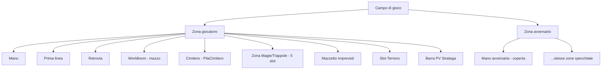

| Elemento | File | Stato |
|---|---|---|
| Campo principale | `Campo.jsx` | ✅ esiste |
| Cella creatura (prima linea/retrovia) | `Campo.jsx · CellaCreatura()` | ✅ |
| Zona Magie/Trappole (5 slot) | `Campo.jsx · FilaMagieTrappole()` | ✅ |
| Pila cimitero | `Campo.jsx · PilaCimitero()` | ✅ |
| Barra PV + contatore turno | `App.jsx · BarraPv()` | ✅ |
| Mano / Mano avversaria | `Mano.jsx` / `ManoAvversaria()` | ✅ |

**🔓 SEZIONE RIAPERTA 19/08, poi RICHIUSA — compattazione generale del campo ANNULLATA.**

Tentativo di comprimere etichette/margini di tutto il campo: **scartato su richiesta esplicita**. Il campo resta identico allo screenshot reale caricato il 19/08 — nessuna modifica a etichette, margini, struttura delle zone.

**Correzione che resta valida** (non è compattazione, è una correzione di fatto): il Terreno **non** è una zona centrale condivisa — ogni giocatore ha il proprio slot personale (cap. 4 del Regolamento), solo l'effetto di uno dei due è attivo alla volta.

| Elemento | File | Stato |
|---|---|---|
| Struttura campo (invariata, come da screenshot) | `Campo.jsx` | ✅ nessuna modifica |
| Terreno: slot personale per giocatore (non condiviso) | `Campo.jsx · SlotTerreno()` | ✅ correzione di fatto, non estetica |
| Ruota Archetipi tra i due Imprevisti | — | 🎯 **DA RIMUOVERE** — unica modifica al campo confermata, il matchup è già sulle carte |
| Bottone "Continua →" | — | 🎯 **DA RIMUOVERE** — ridondante col tap sull'indicatore fase |
| Regola fissa 5:7 | `index.css · --slot-w/--slot-h` | ✅ invariata, mai in discussione |

**✅ SEZIONE CHIUSA — unico intervento sul campo: rimuovere Ruota Archetipi. Tutto il resto (etichette, margini, layout) resta com'è nello screenshot.**

---

## 2. Scansione fasi turno

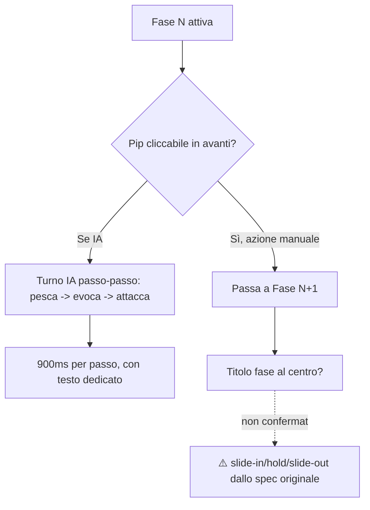

| Elemento | File | Stato |
|---|---|---|
| Pip di fase, cliccabili solo in avanti | `App.jsx · FASI, fasi-pip-cliccabile` | ✅ |
| Turno IA passo-passo (900ms/passo) | `App.jsx / gameReducer.js` | ✅ |
| Titolo di fase centrale con slide-in/out | — | ❌ **NON ESISTE** — confermato, oggi solo il pip |
| Passa il telefono (solo 1v1 locale) | `App.jsx · Partita()`, `telefonoConfermatoPer` | ✅ |

**Nomi delle 5 fasi — DEFINITIVI, battezzati il 19/08:**

| # | Nome vecchio (regolamento v2.1) | Nome nuovo |
|---|---|---|
| 1 | Rifornimento | **Rifornimento** (invariato) |
| 2 | Imprevisti | **Vaticinio** |
| 3 | Evocazione, Spostamenti, Magie e Trappole | **Schieramento** |
| 4 | Attacco | **Alla Carica** |
| 5 | Fine | **Vespro** |

Nota: le Sezioni 4 (Evocazione) e 5 (Posizionamento) di questo foglio vivono **nella stessa Fase 3 — Schieramento**, non sono fasi separate — restano sezioni distinte qui solo perché sono interazioni diverse.

**Punto esatto d'intervento per il rename**: costante `FASI` in `App.jsx`, e ogni occorrenza testuale nel Regolamento v2.1 (cap. 6), nel Regolamento Giocatori, e in `IndicatoreFasi()`. "Attacco" era deliberatamente evitato come nome fase per non collidere con la sezione tecnica "04 · Combattimento" del Codex (la meccanica di scontro, non la fase) — "Alla Carica" risolve l'ambiguità.

**🎯 DECISIONE 19/08 — implementare titolo di fase animato al centro.**
**Punto esatto d'intervento**: nuovo componente (es. `TitoloFase.jsx`), agganciato allo stesso pattern già usato per "fase pinnata" durante l'Imprevisto (`s.faseVisibile` in `gameReducer.js`) — il titolo deve leggere `s.faseVisibile`, non lo stato reale grezzo, per restare sincronizzato con la coda visiva invece di anticipare il cambio. Trigger: ogni volta che `s.faseVisibile` cambia valore. Animazione: comparsa al centro, breve pausa, uscita — non deve bloccare il campo sottostante (overlay leggero, non modale).

**🔒 BLINDATO 19/08 — nomi e animazione definitivi, pronti per l'implementazione.**

**Spec finale animazione titolo di fase** (validata su demo `demo_titolo_fase.html`):
- Fascia orizzontale, altezza ~92px, colore unico **oro/`var(--gold)`** per tutte le fasi (nessuna differenziazione cromatica per fase — scelta deliberata, coerenza con pip attivo e bordo carte eleggibili)
- Fascia: gradiente trasparente→oro 32% opacità→trasparente, saturazione ridotta al 45%
- Entrata: da sinistra, si ferma al centro, 0,5s `cubic-bezier(.2,.7,.25,1)`
- Testo: **tutto maiuscolo**, letter-spacing 0.5px, compare a +260ms dall'inizio fascia
- Pausa: ~1s da testo visibile
- Uscita: fascia verso destra + fade, 0,45s `cubic-bezier(.5,0,.75,.4)`
- Trigger: cambio di `s.faseVisibile` (non lo stato reale grezzo — resta sincronizzato con la coda visiva)
- Nuovo componente: `TitoloFase.jsx`, overlay non bloccante

**Spec finale indicatore compatto** (validata su demo, posizione confermata da screenshot reale del 19/08):
- **Sostituisce** l'attuale barra a 5 tab a piena larghezza ("1 RIFORNIMENTO", "2 IMPREVISTI"...) — oggi in `App.jsx`, tra la barra PV "Il tuo Stratega" e la riga Continua/Registro & Dadi
- **Stessa posizione esatta** di oggi (tra barra PV verde e "La tua mano") — non spostata altrove
- Pillola: monogramma 2 lettere (RI/VA/SC/AC/VE) + nome fase abbreviato
- Tap sul nome = avanza di una fase (stesso comportamento di oggi)
- Chevron a fianco = apre menu a tendina **verso l'alto**: fase corrente evidenziata oro con pallino, fasi passate disabilitate/sbiadite, fasi future cliccabili per saltare direttamente
- **Bottone "Continua →": rimosso** — ridondante col tap sulla pillola
- **Ruota Archetipi (tra i due mazzi Imprevisti): rimossa** — matchup già presente sulle carte
- 🔒 **CONFERMATO 19/08 — regola definitiva**: le azioni obbligatorie delle fasi intermedie (pescare in Rifornimento, tirare il dado in Vaticinio) **non possono essere saltate**. Il menu "salta a fase" deve risolverle automaticamente una per una durante il salto — non bypassarle. Concretamente: saltando da Rifornimento a Vespro, il motore esegue comunque pesca (Rifornimento) e tiro dado (Vaticinio) senza fermarsi ad aspettare input, poi si ferma alla fase scelta. La scelta 1/2 carte in Rifornimento (Regolamento cap. 6, confermata esistente ma senza UI — vedi Sezione 3) è una decisione del giocatore: il salto deve fermarsi lì e non può proseguire oltre finché non è risolta.
- **Tutto il resto del campo (etichette, margini, layout, dimensioni slot) resta invariato rispetto allo screenshot reale — nessun'altra modifica**

**✅ SEZIONE CHIUSA E BLINDATA — pronta per il passaggio a Claude Code.**

---

## 3. Pescata

**🔒 BLINDATO 19/08 — sequenza definitiva, validata su `demo_pescata.html`.**

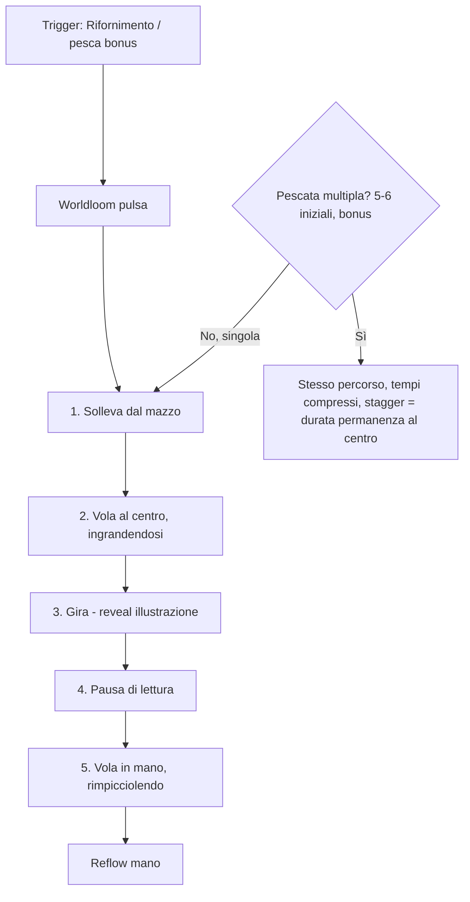

**Spec finale — pescata singola** (normale, 1 carta a turno):
- Solleva dal mazzo: 140ms ease-out
- Vola al centro, scala 1.05→1.8: 350ms, curva quadratica (posizione reale mazzo→centro via `getBoundingClientRect`)
- Flip reveal (dorso→fronte, illustrazione visibile): 300ms `cubic-bezier(.4,0,.2,1)`
- Pausa di lettura al centro: 420ms
- Vola in mano, scala 1.8→1, curva quadratica verso posizione reale dello slot in mano: 390ms
- **Totale: ~1,4s**
- Il flip mostra l'illustrazione **solo al giocatore che pesca** (l'avversario resta coperto, coerente con mano avversaria nascosta), salvo effetti speciali che rivelano esplicitamente

**Spec finale — pescata multipla** (5-6 carte iniziali, pesca bonus da 2): stesso percorso esatto, tempi compressi:
- Solleva: 50ms · Vola al centro (scala 1.05→1.4): 120ms · Flip: 90ms · Pausa: 70ms · Vola in mano: 130ms
- **Stagger tra le carte = 330ms**, calcolato come somma di solleva+alCentro+flip+pausa (il tempo che una carta passa dal sollevamento a quando lascia il centro) — non un numero arbitrario: garantisce che non ci siano mai due carte al centro contemporaneamente
- 5 carte: **totale ~1,8s**, tutte visibili, nessuna sovrapposizione

**Correzione rispetto alla versione precedente**: lo scivolamento in-place (`carta-scivola-dentro`) e il vecchio "non è un vero volo" sono superati da questa spec — volo vero con coordinate reali, in entrambe le varianti.

**Punto esatto d'intervento**: nuovo componente/estensione di `Campo.jsx` + riuso della tecnica di cattura-posizione già in `VfxMagia.jsx` (`getBoundingClientRect` al momento giusto + coda visiva). Sostituisce `@keyframes carta-scivola-dentro` in `index.css`.

**🔒 BLINDATO 19/08 — validato su `demo_scelta_rifornimento.html`. Ultimo gap del foglio, ora chiuso.**

- **Prompt obbligatorio** a inizio Fase 1 (Rifornimento), prima che parta qualunque animazione di pescata: due riquadri grandi, "1 carta / puoi attaccare" vs "2 carte / niente attacco questo turno" — nessuno zoom-carta (non c'è illustrazione da mostrare, stile a parte coerente col resto: pannello scuro, bordo oro)
- **Scelta 1** → pescata singola con reveal al centro (Sezione 3, timing invariato)
- **Scelta 2** → pescata multipla veloce con stagger (Sezione 3, timing invariato), **e** un promemoria persistente per tutto il turno: la pillola "Alla Carica" nell'indicatore di fase si smorza (opacità ridotta, scala di grigi) con un badge rosso "NO ATK"
- **Eccezione invariata**: primo turno, nessuna scelta — chi gioca per primo pesca 5 carte fisse, chi gioca per secondo ne pesca 6 (Regolamento cap. 3)

**Punto esatto d'intervento**: nuovo componente `SceltaRifornimento.jsx` (o simile), montato come primo step della Fase 1 salvo eccezione primo turno. Stato del turno (`nienteAttaccoQuestoTurno` o simile) da propagare fino al componente indicatore fase per smorzare la pillola "Alla Carica" — deve resettarsi automaticamente a inizio del turno successivo.

**✅ TUTTI I GAP DEL FOGLIO SONO ORA CHIUSI — 8 sezioni blindate, zero punti aperti.**

**Nota non-bug**: le pesche bonus da Imprevisti/effetti non fanno pulsare il Worldloom — deliberato, invariato.

**✅ SEZIONE CHIUSA E BLINDATA — pronta per il passaggio a Claude Code.**

---

## 4. Evocazione

**🔒 BLINDATO 19/08 — sequenza definitiva, validata su `demo_evocazione.html`.**

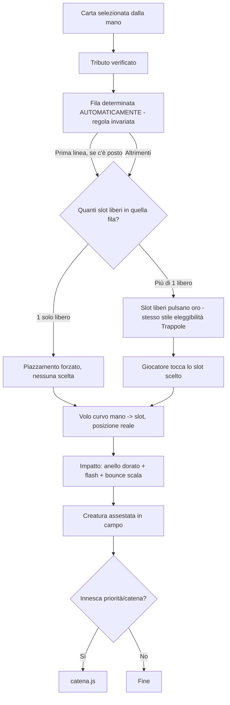

**Correzione importante rispetto alla versione precedente**: la **fila** (prima linea/retrovia) resta decisa dal gioco secondo la regola confermata (`evocazione.js:46` — prima linea se c'è posto, altrimenti retrovia). Non è cambiata. Quello che si aggiunge: **se nella fila già determinata ci sono più slot liberi, il giocatore sceglie quale esatto** — nessun impatto sulle regole, solo su dove atterra visivamente la carta. Se resta un solo slot libero, è forzato senza bisogno di scegliere.

| Step | Evento | File | Timing/Stato |
|---|---|---|---|
| 1 | Carta selezionata, tributo verificato | `evocazione.js` | ✅ |
| 2 | Fila determinata automaticamente (invariato) | `evocazione.js:46` | ✅ regola confermata, non toccata |
| 3 | **Selezione slot nella fila** (solo se >1 libero) — bordo dorato pulsante | — | 🎯 **NUOVO** — riusa lo stile `campo-slot-catena-eleggibile` / `@keyframes campo-slot-catena-pulsa` già esistente per le Trappole, per coerenza visiva |
| 4 | Volo curvo dalla mano allo slot (posizione reale, tecnica di `VfxMagia.jsx`) | — | 🎯 **NUOVO** — ~90ms solleva + ~330ms volo |
| 5 | Impatto — "sbam": anello dorato che si espande + flash + bounce di scala | — | 🎯 **NUOVO** — ~250ms, colore oro uniforme (coerenza con fase/pesca) |
| 6 | Se innesca risposta (es. Trappola "Il Rifiuto della Terra") | `catena.js` | ✅ invariato |

**Totale animazione**: ~0,8s (solleva+volo+impatto+assesta).

**Nota per il futuro, non da costruire ora**: differenziare l'effetto di materializzazione in base alla **rarità** della carta — si aggancia alla fase "Rarity presentation" già in coda nello spec originale (parallax Rare/Foil/Ultra Rare, presentazione Legendary), punto più basso in priorità nel Piano v1.

**✅ SEZIONE CHIUSA E BLINDATA — pronta per il passaggio a Claude Code.**

---

## 5. Posizionamento (prima linea / retrovia)

**🔒 BLINDATO 19/08 — validato su `demo_posizionamento.html`. Animazione distinta dall'evocazione, come richiesto.**

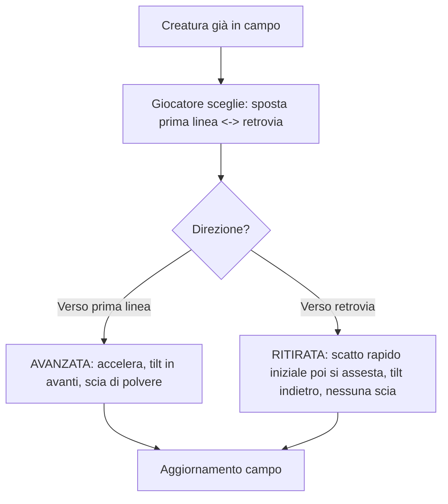

**Principio**: nessun testo a schermo — la direzione si legge solo dalla qualità del movimento, non da un'etichetta. Spostamento laterale (i due gruppi di slot sono affiancati sulla stessa fascia, non uno dietro l'altro), coerente con la disposizione reale confermata da screenshot.

| Elemento | Timing | Dettaglio |
|---|---|---|
| **Avanzata** (retrovia→prima linea) | ~380ms + 150ms assestamento | Accelera (`easeOutCubic`), tilt fino a 6° che si azzera in arrivo, scia di polvere (afterimage ogni ~55ms, fade 0.35s), piccolo overshoot di scala (1.06) all'arrivo |
| **Ritirata** (prima linea→retrovia) | ~320ms + 120ms assestamento | Scatto rapido nel primo 40% del movimento poi decelera, tilt fino a 4° in direzione opposta, leggera contrazione di scala (0.97) durante il moto, **nessuna scia** |

**Nota deliberata**: l'asimmetria (scia solo in avanzata, scatto-poi-freno solo in ritirata) è voluta — rinforza la lettura emotiva del movimento senza bisogno di testo.

**Punto esatto d'intervento**: nuova animazione dedicata in `Campo.jsx`/`gameReducer.js` per lo spostamento fila, **separata** da `carta-piazzata` (evocazione) e dalla sequenza volo+impatto appena blindata in Sezione 4 — motion language distinta apposta.

**✅ SEZIONE CHIUSA E BLINDATA.**

---

## 6. Attivazione effetti

**🔒 BLINDATO 19/08 — validato su `demo_notifica_effetto.html`.**

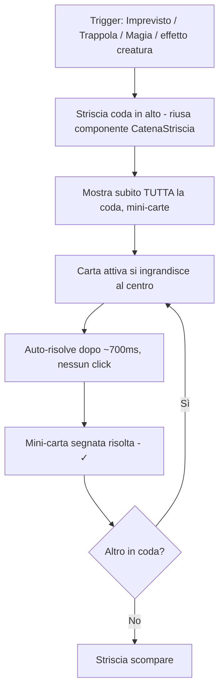

| Elemento | Dettaglio |
|---|---|
| Striscia in alto | Riusa lo stesso componente/stile di `CatenaStriscia.jsx` (Sezione 7) — mostra subito tutte le mini-carte in coda, coerenza visiva totale |
| Carta attiva | Si ingrandisce al centro (120×168px), ~700ms di lettura, poi si chiude da sola |
| Nessun click richiesto | Sostituisce il bloccante-a-click di `NotificaEffetto.jsx` |
| Mini-carta risolta | Segno ✓, opacità ridotta, resta visibile in coda per contesto |
| Campo sottostante | Resta visibile e leggibile durante tutta la sequenza (non è un overlay opaco a piena schermata) |

**Nota tecnica importante, non confondere**: il riuso è **solo visivo** (stessa striscia, stesso stile di zoom). Non implica che queste attivazioni (Imprevisti/Magie dirette/effetti carta) diventino una vera catena a priorità interattiva — restano sequenziali e non rispondibili, coerente con lo scope reale del motore (vedi Sezione 7). Le due cose sono scollegate finché non si decide diversamente.

**Punto esatto d'intervento**: sostituire `NotificaEffetto.jsx` (pop-up bloccante) con nuovo componente che riusa lo stile di `CatenaStriscia.jsx` per la coda + un overlay di zoom centrale non bloccante, temporizzato invece che ad attesa-click.

**✅ SEZIONE CHIUSA E BLINDATA.**

---

## 7. Concatenazione effetti (catena)

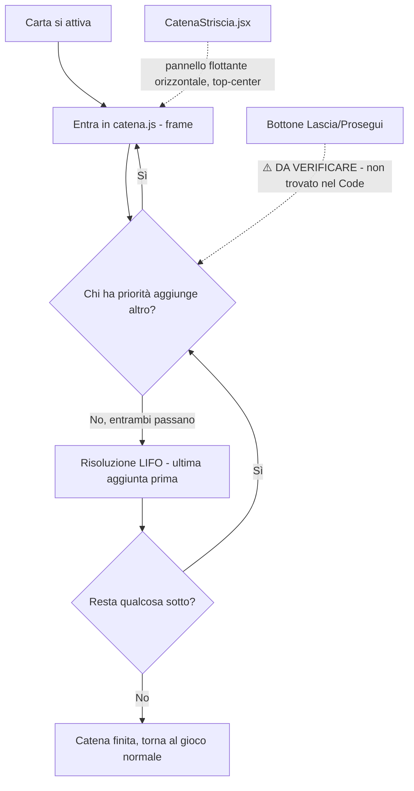

| Elemento | File | Stato |
|---|---|---|
| Motore catena (LIFO, priorità) | `catena.js` | ✅ |
| Striscia visiva (orizzontale, top-center, non opaca) | `CatenaStriscia.jsx` | ✅ |
| Eleggibilità mostrata sul campo (bordo dorato pulsante), non in lista | `Campo.jsx · FilaMagieTrappole()` | ✅ |
| **Bottone "Lascia"/passa priorità** | — | 🔒 **SOSTITUITO E BLINDATO 19/08** — vedi sotto |
| Finestre coperte dalla catena | `catena.js` | ⚠️ solo attacco dichiarato + evocazione. Magie dirette/Imprevisti/effetti carta restano sequenziali |

**🔒 BLINDATO 19/08 — "Concatena/Risolvi" sostituisce il vecchio bottone "Lascia", validato su `demo_concatena_risolvi.html`.**

Il vecchio bottone unico era ambiguo (non diceva chi ha priorità né cosa succede dopo). Sostituito con **due azioni distinte**, sempre entrambe visibili quando è aperta una finestra di priorità:

- **Concatena** — non è un bottone a sé: tocchi direttamente uno slot eleggibile (bordo dorato pulsante, meccanica già esistente) per aggiungere quella risposta alla catena. Ogni concatenazione riapre la finestra di priorità e **riavvia il timer**.
- **Risolvi** — bottone esplicito, sempre visibile (anche con zero eleggibili, per chiarezza) con un **anello di countdown dorato** attorno: 15 secondi, si svuota in tempo reale. Tap esplicito = risoluzione immediata. Timer scaduto = risoluzione automatica, stesso risultato.

| Elemento | Dettaglio |
|---|---|
| Timer | 15s, anello SVG (`stroke-dashoffset`), aggiornato ogni 100ms |
| Reset del timer | Ogni nuova concatenazione lo riavvia da 15s |
| Bottone Risolvi | Sempre presente durante una finestra di priorità, anche senza eleggibili |
| Comportamento a zero eleggibili | Timer scorre comunque, "Risolvi" resta cliccabile, nessuna scelta reale ma coerenza visiva |

**Punto esatto d'intervento**: nuovo componente `PulsanteRisolvi.jsx` (o simile) accanto a `CatenaStriscia.jsx`, con stato countdown collegato al motore `catena.js` — ogni `aggiungiFrame()` deve resettare il timer lato UI. Sostituisce qualunque bottone "Lascia" esistente in `App.jsx`/`Campo.jsx`.

**🔒 BLINDATO 19/08 — scenografia di risoluzione, validata su `demo_catena_ordine.html`.** Chiude il gap "Da fare" segnalato dal Codex.

- **Ordine LIFO visibile**: le mini-carte in striscia mostrano un numero d'ordine (#1, #2...) quando si risolvono, sempre dall'ultima aggiunta alla prima
- **Carta attiva**: si ingrandisce al centro (stesso stile riusato dalla Sezione 6), numero d'ordine assegnato in quel momento
- **Connessione visiva al bersaglio — due casi distinti**:
  - **Bersaglio sul campo** (creatura/Stratega): linea tratteggiata dorata dalla carta zoomata al bersaglio, con un punto che vi "viaggia sopra" (~350ms), il bersaglio si illumina di **rosso** all'impatto
  - **Bersaglio è un'altra carta della catena stessa** (es. contromagia che annulla direttamente un'altra risposta): la linea punta **dentro la striscia**, verso la mini-carta bersaglio, che si marca con una ✕ rossa (annullata) invece che con il segno ✓ di risolta
- **Carta annullata**: quando arriva il suo turno nell'ordine di risoluzione, **non si risolve** — salta silenziosamente (nessuna nuova animazione, resta con la ✕)
- **Nota naming**: nella demo i bersagli sul campo sono etichettati genericamente ("Slot 1/2/3") — nel gioco reale vanno usati i nomi di zona veri (es. "Prima linea, posizione 2")

**Punto esatto d'intervento**: nuovo componente scenografia dentro/accanto a `CatenaStriscia.jsx` — SVG per la linea di connessione (path quadratico + punto animato lungo `getPointAtLength`), stato `annullata` da aggiungere al modello dati dei frame della catena (`catena.js`) per distinguere "risolta" da "annullata da un'altra carta".

**✅ SEZIONE 7 CHIUSA E BLINDATA — tutti i punti risolti, incluso il bottone "Lascia".**

---

## 8. Combattimento

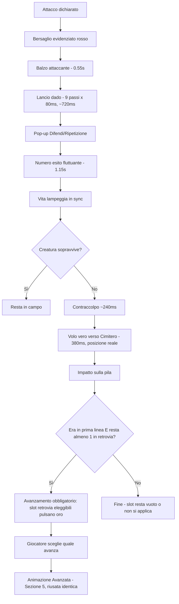

**🔒 BLINDATO 19/08 — fix validato su `demo_morte_combattimento.html` (bug ricreato affiancato alla versione corretta).**

| Step | Evento | File | Timing | Stato |
|---|---|---|---|---|---|
| 1 | Bersaglio evidenziato rosso | `Campo.jsx · CellaCreatura()` | per tutto lo scontro | ✅ |
| 2 | Balzo attaccante | `Campo.jsx / index.css` | 0.55s ease-in-out | ✅ |
| 3 | Lancio dado | `LancioDado.jsx` | 9×80ms (~720ms) | ✅ |
| 4 | Pop-up Difendi/Ripetizione | `PromptCombattimento.jsx` | attesa utente, gated da `idBalzoRichiesto`/`idDadoRichiesto` | ✅ |
| 5 | Numero esito fluttuante | `Carta.jsx / index.css` | 1.15s ease-out | ✅ |
| 6 | Vita lampeggia | `index.css · vita-flash-danno` | 1.15s, sincrono con Step 5 | ✅ |
| 7a | Sopravvive | `gameReducer.js` | — | ✅ invariato |
| 7b | **Muore** — sequenza corretta | vedi sotto | ~740ms totali | 🔒 **FIX BLINDATO** |
| 8 | **Avanzamento obbligatorio** (se in prima linea e retrovia non vuota) | vedi sotto | 🔒 **NUOVO 19/08, integrato** |

**Fix per il caso 7b — morte:**
1. **Contraccolpo** (~240ms): scatto laterale ±6px con rotazione ±4°, due impulsi rapidi (60ms ciascuno) poi ritorno al centro (120ms) — la creatura "accusa il colpo"
2. **Volo vero verso il Cimitero** (~380ms): stessa tecnica di cattura-posizione già usata in Pescata/Evocazione (`getBoundingClientRect`), non uno scatto istantaneo — durante il volo: scala che si riduce (fino a -40%), rotazione fino a 180°, opacità che scende leggermente (-30%)
3. **Impatto sulla pila del Cimitero**: piccolo bounce di scala (già esistente come pattern, riusato)

**Step 8 — Avanzamento obbligatorio (NUOVO 19/08)**

**Regola** (Regolamento cap. 4, trovata rileggendo il documento): *"Se un Alieno in prima linea muore e hai almeno un Alieno in retrovia, lo slot non può restare vuoto: uno dei tuoi Alieni in retrovia deve avanzare a coprirlo... Scegli tu quale."* — diverso dallo spostamento volontario di Sezione 5 (quello solo in Fase 3): questo scatta **subito dopo qualunque morte in prima linea**, anche in pieno combattimento.

- **Trigger**: subito dopo lo Step 7b (impatto sul Cimitero), solo se (a) la creatura morta era in prima linea, e (b) il giocatore ha almeno un'altra creatura viva in retrovia
- **Selezione**: se c'è più di una creatura in retrovia, si riusa lo stesso pattern già blindato in Addendum A (slot eleggibili con bordo oro pulsante, tap per scegliere). Se ce n'è solo una, l'avanzamento è forzato senza bisogno di scegliere (stesso principio già usato per il targeting attacco)
- **Animazione**: la creatura scelta esegue esattamente l'animazione "Avanzata" già blindata in Sezione 5 (accelera, tilt in avanti, scia di polvere, ~380ms) — nessuna nuova animazione da inventare, puro riuso
- **Se non c'è nessuno in retrovia**: lo slot resta semplicemente vuoto, nessuna azione

**Causa del bug originale (confermata)**: nessuna guardia sul rendering delle creature morte — solo i pop-up (`idBalzoRichiesto`/`idDadoRichiesto`) aspettavano la coda visiva, non la rimozione dal campo (`giocatore.js · ripulisciCampo()`), che avveniva istantanea e fuori sync.

**Punto esatto d'intervento**: in `giocatore.js`, `ripulisciCampo()` non deve rimuovere la creatura dall'array di stato finché la coda visiva non ha esaurito Step 1-6. Aggiungere una guardia simmetrica a `idBalzoRichiesto`/`idDadoRichiesto` (es. `idMorteRichiesta`) che blocca la rimozione reale finché l'animazione di morte (contraccolpo+volo+impatto) non è stata completamente giocata. Nuovo componente o estensione di `Campo.jsx`/`PilaCimitero()` per il volo. **Per lo Step 8**: dopo la rimozione effettiva, controllare `retrovia.length > 0` e innescare lo stesso stato di selezione già usato per il targeting attacco (Addendum A), poi la stessa funzione di animazione Avanzata già scritta per Sezione 5 — nessun nuovo componente, solo orchestrazione in sequenza di codice già esistente.

**✅ SEZIONE 8 CHIUSA E BLINDATA (aggiornata 19/08 con Step 8) — foglio completo, tutte le 8 sezioni chiuse.**

---

## Tracker demo da costruire (una alla volta, qui in chat)

| # | Demo | Sezione | Stato |
|---|---|---|---|
| 1 | Morte in combattimento: sequenza corretta vs bug attuale | 8. Combattimento | 🔒 Fatto e blindato |
| 2 | Notifica effetto: coda + zoom automatico | 6. Attivazione effetti | 🔒 Fatto e blindato |
| 3 | Pescata: volo vero con reveal al centro (singola + multipla) | 3. Pescata | 🔒 Fatto e blindato |
| 4 | Concatena/Risolvi (sostituisce "Lascia") + scenografia catena con connessione al bersaglio | 7. Concatenazione | 🔒 Fatto e blindato |
| 5 | Titolo di fase scivolante + indicatore compatto | 2. Fasi turno | 🔒 Fatto e blindato |
| 6 | Evocazione: selezione slot nella fila + volo/impatto | 4. Evocazione | 🔒 Fatto e blindato |
| 7 | Avanzata/Ritirata (posizionamento) | 5. Posizionamento | 🔒 Fatto e blindato |
| 8 | Scelta 1 carta / 2 carte rinunciando all'attacco (Fase 1) | 3. Pescata | 🔒 Fatto e blindato |

---

## Confronto con il Piano Prioritario v1

- Punto 1 del Piano (bug balzo/dado) = qui Sezione 8, causa diagnosticata e fix blindato.
- Punto 2 del Piano (bottone "Lascia") = qui Sezione 7, sostituito da Concatena/Risolvi, blindato.
- Punto 3 del Piano (scope catena) = qui Sezione 7, invariato — resta scoped a attacco/evocazione, non generalizzato.
- Punto 4 del Piano (audio) e Punto 5 (orientamento Chain UI orizzontale, confermato) non hanno una sezione propria in questo foglio — restano validi, da tenere presenti, non duplicati qui.
- La Ghost Card di piazzamento evocazione, presente nello spec originale e nel Piano v1 come ⚠️, è stata tolta — confermato che non si applica a Worldloom (il piazzamento della fila resta automatico, solo lo slot nella fila è scelto dal giocatore).

---

## Addendum — dal confronto con lo spec ChatGPT originale (Sezioni 6, 10, 11)

Tre punti nuovi emersi rileggendo lo spec generico, non coperti dalle 8 sezioni sopra. Tutti e tre validati su demo e blindati.

### A. Targeting attacco — evidenziazione preventiva dei bersagli

**🔒 BLINDATO 19/08 — validato su `demo_targeting_attacco.html`.**

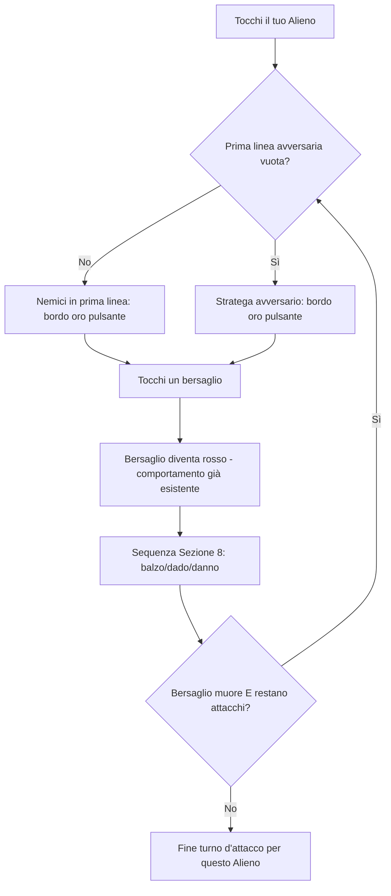

- **Colore riusato**: bordo oro pulsante, stesso linguaggio già usato per l'eleggibilità delle Trappole (`campo-slot-trappola-catena-eleggibile`) — coerenza visiva totale, nessun nuovo colore introdotto
- **Trigger**: tap sull'Alieno attaccante apre la selezione; i bersagli eleggibili si illuminano subito, prima di qualunque scelta
- **Regola confermata dal Regolamento** (non un'ipotesi): *"Chi attacca sceglie il bersaglio a ogni singolo attacco, non una volta sola"* — se un bersaglio muore e restano attacchi disponibili, la selezione **si riapre automaticamente** sui nemici rimasti
- **Caso prima linea vuota**: solo allora lo Stratega avversario diventa eleggibile (bordo oro), mai insieme alle creature
- **Bersaglio scelto**: torna al comportamento già esistente (bordo rosso, confermato in Sezione 8) — l'evidenziazione preventiva è solo un passaggio aggiunto PRIMA della scelta, non sostituisce nulla

**Punto esatto d'intervento**: nuovo stato in `Campo.jsx` (es. `bersagliEleggibili`) calcolato quando l'attaccante entra in "modalità attacco" — riusa la stessa classe CSS `campo-slot-trappola-catena-eleggibile` già esistente invece di crearne una nuova.

### B. Stat modifiers — numero fluttuante +X/-X

**🔒 BLINDATO 19/08 — validato su `demo_stat_modifiers.html`.**

- **Aggiunta**, non sostituzione: il colore persistente su Attacco/Parata (verde se alzate, rosso se abbassate) **resta invariato** — si aggiunge solo un numero fluttuante temporaneo (+X verde / -X rosso) nel momento esatto del cambiamento, ~750ms, fade + leggero movimento verso l'alto
- **Regola di clamp confermata**: Attacco e Parata **non vanno mai sotto 0** — se un debuff supererebbe la statistica attuale, il numero fluttuante mostra il **delta realmente applicato**, non quello richiesto (es. -30 richiesto su una Parata a 20 mostra "-20", risultato finale 0)
- **Vita a 0 non è un caso di questa sezione**: attiva la sequenza morte già blindata in Sezione 8 (contraccolpo + volo al Cimitero) — non duplicata qui, solo collegata concettualmente

**Punto esatto d'intervento**: estensione di `Carta.jsx`/`Campo.jsx` dove già vive `carta-stat-alterata-su`/`carta-stat-alterata-giu` — aggiungere il numero fluttuante come layer visivo temporaneo sopra la stessa logica, con clamp a 0 applicato prima di calcolare il delta da mostrare.

### C. Damage — card shake

**🔒 BLINDATO 19/08 — validato su `demo_stat_modifiers.html`.**

- **Aggiunta** alla sequenza danno già blindata in Sezione 8: scuotimento breve della carta colpita (~350ms, oscillazione orizzontale ±6px con lieve rotazione, ampiezza decrescente), simultaneo al numero di danno fluttuante e al lampeggio Vita già esistenti — non li sostituisce

**Punto esatto d'intervento**: nuova animazione CSS (`@keyframes scuoti-carta`) applicata a `Carta.jsx` nello stesso istante in cui scatta `vita-flash-danno` (Sezione 8, Step 6).

### D. Scarta (mano → cimitero)

**🔒 BLINDATO 19/08 — validato su `demo_scarta.html`.**

**Nota di scope**: verificato che bounce (ritorno in mano), mill (pesca forzata dal mazzo altrui) e shuffle (rimescolamento) **non esistono come meccaniche nel Regolamento** — nessuna carta li usa. Sono concetti generici dello spec ChatGPT originale non applicabili a Worldloom. Solo "Scarta" (parola chiave reale, cap. 16: sposta dalla mano al cimitero senza attivare l'effetto) aveva un gap di animazione reale, ora colmato.

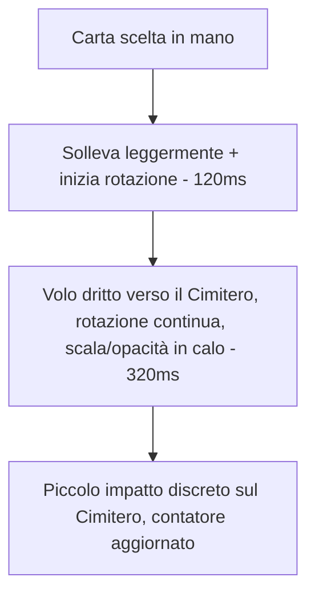

- **Deliberatamente diversa dalla morte** (Sezione 8): nessun contraccolpo, nessun "sbam", nessun flash — deve sentirsi leggera, perché l'effetto della carta **non si attiva**
- **Deliberatamente diversa dall'attivazione effetto** (Sezione 6): nessuna coda/zoom centrale, perché non c'è nulla da risolvere
- Timing totale: ~440ms, il più rapido tra tutte le animazioni di movimento carta del foglio — coerente con l'essere l'azione "minore" tra le uscite di carta

**Punto esatto d'intervento**: nuovo componente o estensione di `Mano.jsx`/`Campo.jsx · PilaCimitero()`, stessa tecnica di cattura-posizione (`getBoundingClientRect`) già riusata ovunque nel foglio. Nuova animazione CSS dedicata, non condivisa con `carta-piazzata` (evocazione) né con la sequenza morte (Sezione 8).

---

### E. Rarity presentation

**🔒 BLINDATO 19/08 — validato su `demo_rarita.html`.**

**Scala di rarità — DEFINITA per la prima volta** (era un punto aperto nel documento di direzione grafica): **Comune → Rara → Ultrarara → Epica → Leggendaria**, 5 livelli, ordine crescente confermato.

**Principio guida**: nessun nuovo colore pieno — Worldloom ha già colori fissi per tipo carta (Creatura avorio, Magia blu, Trappola viola, Imprevisto arancio) e per gruppo archetipico (5 colori); aggiungere colori di rarità avrebbe rischiato collisioni (es. una Trappola viola con rarità "epica" spesso viola in altri TCG). La rarità si esprime solo per **intensità/effetto crescente**, sopra i colori esistenti.

| Rarità | Effetto | Dettaglio |
|---|---|---|
| Comune | Nessuno | Baseline, animazione standard |
| Rara | Bagliore tenue | Pulsa lentamente, box-shadow oro-tenue, 2.5s ease-in-out |
| Ultrarara | Bagliore + luccichio | Sweep di luce che attraversa la carta ogni ~3.2s |
| Epica | Bagliore più marcato + luccichio più frequente + parallax automatico leggero | L'illustrazione si muove leggermente da sola (non serve interazione) |
| Leggendaria | Tutto il precedente, più intenso (1.6s) + particelle dorate fluttuanti + parallax reale nello zoom | Nello zoom (`DettaglioCarta.jsx`), l'illustrazione segue il movimento del mouse/dito |

- **Dove si applica**: **ovunque** — mano, campo, zoom. Rischio di distrazione riconosciuto e accettato consapevolmente (non un oversight) dopo aver visto la demo con tutti e 5 i livelli fianco a fianco
- **Collegamento con la Sezione 4 (Evocazione)**: la nota già presente lì ("differenziare la materializzazione in base alla rarità, non costruita subito") ora ha una base concreta — la materializzazione di una carta Leggendaria può riusare lo stesso linguaggio (particelle, bagliore intenso) del suo stato a riposo, per coerenza

**Punto esatto d'intervento**: nuove classi CSS per rarità (`carta-rara`, `carta-ultrarara`, `carta-epica`, `carta-leggendaria`) applicate condizionalmente in `Carta.jsx` in base al campo dati `rarita` già esistente nello schema carte. Il parallax nello zoom va in `DettaglioCarta.jsx`, gated a `rarita === 'leggendaria'` (o estendibile a Epica se si decide in futuro).

---

### F. Audio effetti + Heal

**🔒 BLINDATO 19/08 (impostazioni) — 🎨 BOZZA APERTA (scelte sonore specifiche), validato su `demo_audio_heal.html`.**

**Heal — parte blindata**: la Vita che aumenta (nessuna parola chiave "Cura" trovata nel Regolamento — l'unico caso confermato è il passivo Tank "+3 Vita permanenti quando un alleato viene distrutto") riusa il linguaggio del buff già stabilito in Addendum B: numero fluttuante +X verde, **con l'aggiunta di 8 particelle verdi che convergono sulla carta** (differenzia visivamente "vita che sale" da un semplice buff di Attacco/Parata). Stessa disciplina di clamp già stabilita altrove (Vita non supera il massimo della carta, da applicare qui).

**Audio — impostazioni, blindate**:
- Nuovo toggle **"Effetti sonori"** nel pannello impostazioni, separato dal toggle musica già esistente (`wl_musica_attiva`) — icona altoparlante, stesso stile del toggle musica
- Persistito allo stesso modo (localStorage, es. `wl_effetti_attivi`)
- Controlla SOLO gli effetti sonori di gioco (pesca, danno, ecc.), la musica di sottofondo resta indipendente

**Audio — scelte sonore, ancora bozza da affinare**: la demo copre 10 momenti (pesca, evocazione, dado, danno, heal, morte, cambio fase, scarta, vittoria, sconfitta) con suoni sintetizzati placeholder (Web Audio API, oscillatori) solo per validare ritmo/durata — **non sono gli asset audio finali**, quelli andranno commissionati/scelti separatamente. Struttura approvata come impostazione di partenza, dettagli sonori da rivedere in una sessione dedicata.

**Punto esatto d'intervento**:
- `PannelloOpzioni.jsx` (o dove vive il toggle musica) — aggiungere il secondo toggle "Effetti sonori"
- Nuovo modulo audio (es. `effettiSonori.js`) con una funzione per momento di gioco, agganciata ai trigger già esistenti in `gameReducer.js`/coda visiva — quando gli asset veri saranno pronti, sostituiscono i placeholder sintetizzati
- Heal: estensione dello stesso layer di `Carta.jsx` usato per il numero fluttuante di Addendum B, più nuovo effetto particellare CSS dedicato

---

### G. Accessibilità — palette colori

**🔒 STRUTTURA BLINDATA 19/08 — 🎨 COLORI SPECIFICI DA RICONFERMARE**, validato su `demo_palette_colori.html`. A differenza degli altri punti, qui il game designer ha chiesto esplicitamente di riflettere ancora sui colori esatti prima di considerarli definitivi — non trattarli come chiusi al 100%.

**Decisione ferma (questa sì blindata)**: **eliminati i 5 colori di gruppo archetipico**. Motivazione, verificata nel documento di direzione grafica stesso: *"dentro la coppia distingue il nome scritto, non il colore"* — il colore-archetipo non ha mai portato informazione funzionale, solo decorazione sopra un sistema (nome scritto + frecce forte/debole) già completo. Inoltre erano progettati per un roster futuro a 10 archetipi (accoppiamenti), non necessari con i 5 attuali. Restano **solo i 4 colori di tipo carta** (Creatura/Magia/Trappola/Imprevisto).

**Problema reale trovato e risolto**: i colori originali di Magia (`#5EA8E8`) e della statistica Difesa (`#5AA9E6`) erano **quasi identici** (differenza percettiva 7.2, sotto soglia di distinguibilità) — collisione confermata con calcolo, non a occhio.

**Verifica fatta, non a occhio**: contrasto WCAG AA (soglia 4.5:1 su sfondo scuro app) e simulazione approssimata di deuteranopia (daltonismo rosso-verde) su tutte le coppie critiche. Risultato positivo non previsto: Forte/Debole e Vita/Attacco reggono bene anche sotto simulazione — probabilmente perché differiscono anche per **forma** (▲/▼, cuore/spada), non solo colore. Nessun intervento necessario lì.

**Palette di tipo — versione corrente, da riconfermare in una sessione dedicata**:

| Tipo | Colore proposto | Contrasto su sfondo scuro |
|---|---|---|
| Creatura | Terracotta `#C97B4E` | 6.06 |
| Magia | Teal cosmico `#3FBFB5` | 8.80 |
| Trappola | Orchidea `#CE6BB0` | 5.99 |
| Imprevisto | Ambra dorata `#E0A030` | 8.71 |

Tutti sopra soglia WCAG AA, zero collisioni con i colori fissi esistenti (oro/vita/difesa/attacco/forte/debole), distanza minima tra i 4 nuovi colori pari a 94.5 (ampiamente sopra la soglia di attenzione di 25).

**Nota esplicita per Claude Code e per le prossime sessioni**: il game designer non è ancora pienamente convinto di questa combinazione specifica (in particolare Magia/Trappola) — la struttura (4 colori, no archetipo-colore, niente collisioni) è solida e verificata, ma i 4 valori esadecimali esatti vanno ridiscussi prima di stamparli su carte fisiche. Non trattare questa tabella come intoccabile.

**Punto esatto d'intervento**: variabili CSS di tipo in `index.css` (sostituire i valori di Creatura/Magia/Trappola/Imprevisto), rimuovere ogni riferimento a colore-archetipo in `Carta.jsx`/`Campo.jsx` (il nome archetipo resta, solo il colore associato sparisce). Stessa modifica va applicata al file sorgente della grafica di stampa (`claude_direzione-grafica-full-art.md` menziona lo schema colori — va aggiornato in parallelo, fuori da questo repo di codice).

---

### H. Nuove parole chiave di regola — per carte future

**🔒 BLINDATO 19/08.** Diverso dagli altri punti dell'addendum: qui non stiamo colmando un gap UX di qualcosa che già esiste, stiamo **definendo regole nuove** che non hanno ancora nessuna carta — servono da base per quando disegnerai carte che le usano. Le animazioni riusano tecniche già blindate altrove nel foglio, nessuna nuova meccanica visiva da inventare.

**Rimanda in mano** *(bounce)*
> La carta bersaglio (creatura) torna nella mano del proprietario. Se era stata evocata pagando un tributo, il tributo è perso — per rievocarla va ripagato da capo. Disponibile su Magie, Trappole ed effetti di Creatura. **Nessun limite di Livello di default** — singole carte potranno restringerlo (es. "solo Livello 1") in fase di disegno.
> ⚠️ **Rischio di bilanciamento segnalato**: senza limiti, un bounce su una creatura da 3 tributi è uno scambio molto pesante (annulla un investimento di 3 carte con una sola). Non bloccante — il limite si applica carta per carta quando le disegnerai, non è un tetto obbligatorio a livello di parola chiave.
> **Animazione**: riusa il volo curvo già blindato (Sezione 4/Evocazione, invertito: campo→mano invece di mano→campo), nessuna nuova tecnica.

**Sotterra** *(mill — nome provvisorio)*
> Il bersaglio (un mazzo, proprio o avversario, specificato dalla carta) manda N carte dalla cima direttamente al Cimitero, coperte, senza rivelarle salvo che l'effetto lo richieda esplicitamente.
> ⚠️ **Debito di design segnalato**: oggi Worldloom non ha nessuna sinergia di recupero dal Cimitero — le prime carte con questa parola chiave saranno meccanicamente deboli (puro svantaggio di carte, nessun payoff) finché non progetti un sotto-sistema di sinergie cimitero (rianimazione, pesca dal cimitero, ecc.). Confermato dal game designer di volerla definire comunque ora.
> **Animazione**: estrazione dal mazzo → volo diretto al Cimitero, stessa tecnica già usata per Scarta (Addendum D), coperta di default.

**Disperdi nel mazzo** *(shuffle-da-ritorno)*
> Il bersaglio torna coperto nel mazzo del proprietario, che viene rimescolato subito dopo. Più punitivo di "Rimanda in mano": niente ritorno in mano, diventa una pesca futura casuale. Pensata per rimozioni più forti/rare.
> **Animazione**: volo verso il mazzo (rotazione a coperta durante il volo) + animazione di rimescolamento del mazzo (nuova, non ancora costruita — vedi nota sotto).

**Cerca** *(ricerca nel mazzo)*
> Guarda le prime N carte del proprio mazzo (o dell'avversario, se la carta lo specifica), scegli una secondo il criterio indicato, mettila nella destinazione indicata (mano/campo/cimitero). Le carte non scelte tornano nel mazzo nell'ordine originale, salvo che l'effetto specifichi diversamente. **Regola di rimescolamento**: se una o più carte vengono rimesse nel mazzo dopo essere state viste, il mazzo si rimescola — salvo che la carta dica esplicitamente "in cima"/"in fondo"/altra posizione fissa.
> **Due modalità di presentazione** (per quando la userai): **Vista di ricerca** (le carte candidate si mostrano scoperte in una UI di selezione, il giocatore ne sceglie una) oppure **Rivelazione diretta** (si estrae una carta, si rivela, si risolve — nessuna scelta tra più opzioni). La modalità dipende dal testo della carta specifica, non va decisa a priori qui.
> **Animazione**: riusa il reveal-al-centro già blindato in Sezione 3 (Pescata singola) per la Rivelazione diretta; la Vista di ricerca è un nuovo layout (griglia di carte scoperte) da progettare quando la prima carta reale la userà.

**Nota trasversale — rimescolamento mazzo**: la versione **iniziale** (a inizio partita) è ora progettata nel punto I qui sotto. Resta da fare la versione **innescata a metà partita** da "Disperdi nel mazzo"/"Cerca" (Punto H) — stessa animazione di base, riutilizzabile.

**Punto esatto d'intervento**: queste sono regole di gioco, non solo UX — vanno aggiunte al Regolamento (nuovo capitolo parole chiave, insieme a quelle già esistenti: Sacrifica, Annulla, Distruggi, Evoca normale/speciale, Scarta, Bersaglio/Seleziona/Indica, Tira dado) prima ancora di toccare il codice. Il codice segue dopo, quando le prime carte reali le useranno — non c'è un componente da costruire subito, solo la definizione di regola.

---

### I. Rimescolamento iniziale (a inizio partita)

**🔒 BLINDATO 19/08 — validato su `demo_rimescolamento.html`.**

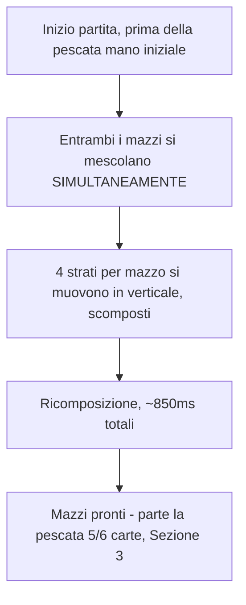

- **Simultaneo**: entrambi i mazzi (il tuo in basso, l'avversario in alto — coerente con la disposizione reale confermata da screenshot) si mescolano insieme, non in sequenza
- **Movimento verticale** (non orizzontale): 4 strati per mazzo si scompongono su/giù con lieve rotazione, danno la sensazione fisica del riffle senza mostrare carte singole — coerente col principio dello spec originale ("l'obiettivo è una sensazione fisica, non mostrare ogni carta")
- **Durata**: 850ms, fascia alta della forchetta 500-900ms suggerita — scelto percepibile, non discreto
- **Audio**: aggiunto alla lista dell'Addendum F (ancora bozza) — rumore filtrato tipo "frrrt", sintetizzato nella demo come placeholder
- **Trigger**: a inizio partita, prima della pescata della mano iniziale (5 carte per chi gioca primo, 6 per chi gioca secondo — Sezione 3, invariata)

**Punto esatto d'intervento**: nuovo componente/animazione su `Campo.jsx` (entrambe le pile Worldloom), 4 layer duplicati temporanei per mazzo con keyframe verticali scomposti, rimossi a fine animazione. Nuovo suono nel modulo `effettiSonori.js` già previsto in Addendum F.

---

### J. Effetti simultanei su più bersagli

**🔒 BLINDATO 19/08 — validato su `demo_effetti_simultanei.html`.**

**Gap risolto**: nella coda di Sezione 6, un effetto che colpisce più bersagli insieme (es. "+5 Attacco a tutte le tue creature") oggi rischierebbe di diventare una sequenza di N zoom ripetuti invece di un singolo evento — la carta si ingrandisce **una sola volta**, non una per bersaglio.

**Due trattamenti distinti, in base a come è scritto l'effetto della carta:**

| Caso | Esempio | Trattamento visivo |
|---|---|---|
| Bersagli **scelti individualmente** (usa la parola chiave "Bersaglio/Seleziona/Indica" già esistente nel Regolamento) | "Bersaglio: distruggi 2 creature a scelta" | **Linee multiple** dalla carta zoomata a ciascun bersaglio scelto, tutte insieme, stesso stile della connessione già blindata in Sezione 7 |
| **Intero gruppo per regola**, nessuna scelta | "+5 Attacco a tutte le tue creature" | **Onda/bagliore unico** che si espande sulla zona colpita, ogni creatura mostra il proprio numero fluttuante (Addendum B) simultaneamente — nessuna linea, per evitare groviglio visivo |

**Criterio di applicazione (per Claude Code, non ambiguo)**: la distinzione va nello **schema dati dell'effetto della carta**, non inferita a runtime dal testo. Esempio di struttura:
```
bersaglio: { tipo: "scelta", quantità: N }        → linee multiple
bersaglio: { tipo: "gruppo", ambito: "tue_creature" | "creature_avversarie" | "tutti" }  → onda unica
```
Il motore legge questo campo e sceglie automaticamente quale animazione usare — nessuna logica di interpretazione testuale necessaria.

**Punto esatto d'intervento**: estensione dello schema carte (campo `bersaglio` sulla definizione di ogni effetto), nuovo componente di risoluzione in `Campo.jsx`/coda visiva di Sezione 6 che ramifica in base a `bersaglio.tipo`. Riusa: linea SVG già scritta per Sezione 7, numero fluttuante già scritto per Addendum B.

---

### K. Connessione causale anche in Sezione 6 (fuori dalla vera catena)

**🔒 BLINDATO 19/08 — validato su `demo_connessione_sezione6.html`.**

**Gap risolto**: la linea di connessione sorgente→bersaglio esisteva finora solo per la vera catena a priorità (Sezione 7) e per gli effetti simultanei (Addendum J). La coda sequenziale "normale" di Sezione 6 (Imprevisti/Magie dirette/effetti carta fuori dalle finestre di priorità) mostrava solo lo zoom, senza mai collegarsi visivamente al bersaglio reale sul campo.

**Regola semplice**: stessa tecnica già scritta (linea SVG, path quadratico, stile oro tratteggiato) applicata anche qui — **se l'effetto ha un bersaglio reale sul campo, la linea appare**; se non ce l'ha (es. un Imprevisto che fa solo pescare una carta extra, nessuna creatura coinvolta), nessuna linea, solo zoom e risoluzione come già blindato.

**Nessuna nuova tecnica**: puro riuso del componente SVG già scritto per Sezione 7/Addendum J, applicato a un contesto in più (coda sequenziale invece che solo catena/simultanei).

**Punto esatto d'intervento**: nel componente di risoluzione coda di Sezione 6, controllare se l'effetto in risoluzione ha un campo `bersaglio` con un target di campo valido (non un bersaglio-catena come in Addendum J, un vero slot/creatura) — se sì, invocare lo stesso componente linea SVG già esistente; se no, procedere come oggi (solo zoom).

---

### L. Interazione PC vs Mobile — principio dichiarato

**🔒 BLINDATO 19/08 — nessuna nuova costruzione, solo formalizzazione.**

Rileggendo lo spec ChatGPT originale (Sezione 4), che assume una grammatica hover+drag su PC diversa dal tap su mobile: **non si applica a Worldloom**. Ogni singola interazione progettata in questo foglio — evocazione, targeting attacco (Addendum A), selezione slot (Sezione 4), risoluzione catena (Sezione 7) — usa esclusivamente il **tap** (click su PC, touch su mobile), mai drag, mai un passaggio di hover-preview prima di confermare.

**Principio confermato dal game designer**: tap ovunque, click e touch sono la stessa identica azione, nessuna doppia grammatica da mantenere tra piattaforme. Valutata e scartata esplicitamente l'idea di un hover-preview bonus per desktop.

**Nessun punto d'intervento**: non c'è nulla da costruire — questo punto esiste per chiudere esplicitamente la domanda, non per generare lavoro. Se in futuro emergesse il bisogno di un'interazione specifica per desktop, va riaperta qui.

---

### M. Lancio della moneta (chi inizia)

**🔒 BLINDATO 19/08 — validato su `demo_lancio_moneta.html`.**

**Gap risolto**: il Regolamento prevede *"Chi inizia — lancio della moneta. Prima della prima Fase 1 della partita, si decide a caso chi gioca per primo"* — nessuna animazione era mai stata progettata per questo momento, in nessuna sezione del foglio.

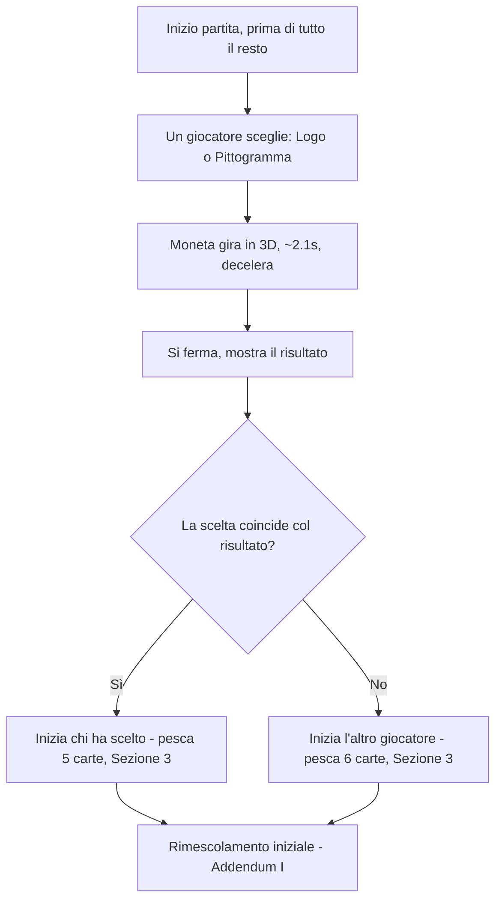

- **Facce della moneta**: non testa/croce generico — **logo testuale "WORLDLOOM"** su una faccia, **pittogramma** (il nodo/simbolo circolare del logo, senza scritta) sull'altra. Identità visiva invece di un elemento neutro.
- **Scelta preventiva**: un giocatore sceglie Logo o Pittogramma prima del lancio (come "testa o croce" classico), non è un lancio automatico senza interazione
- **Animazione**: rotazione 3D reale (CSS `rotateY`, `preserve-3d`, `backface-visibility`), 7 giri completi con decelerazione (`cubic-bezier(.2,.6,.35,1)`), ~2.1s totali — stile realistico/lento come richiesto, non stilizzato/veloce
- **Esito collegato alle regole già blindate**: chi vince il lancio inizia e pesca secondo la Sezione 3 (5 carte); chi perde pesca 6 (compensazione turno di svantaggio, cap. 3) — poi segue il Rimescolamento iniziale già progettato in Addendum I
- **Posizione nel flusso di partita**: questo è il primissimo evento assoluto, prima ancora del rimescolamento (Addendum I) — ordine corretto: lancio moneta → rimescolamento → pescata mano iniziale

**Nota grafica**: il pittogramma nella demo è un'approssimazione SVG generica (nodo circolare stilizzato) — non ho l'asset vero del logo Worldloom. Da sostituire con la grafica reale in fase di implementazione.

**Punto esatto d'intervento**: nuovo componente `LancioMoneta.jsx` (o simile), montato come primissimo step di `Partita()` in `App.jsx`, prima di qualunque altra inizializzazione — comprese Addendum I (rimescolamento) e Sezione 3 (pescata iniziale), che restano invariate e vengono semplicemente innescate dopo l'esito del lancio.

---

## Stato finale — 19/08

**8 sezioni su 8 completamente chiuse e blindate (Sezione 8 aggiornata con l'avanzamento obbligatorio), più un addendum di 13 punti (targeting, stat modifiers, card shake, scarta, rarity presentation, audio+heal, accessibilità/palette, nuove parole chiave per carte future, rimescolamento iniziale, effetti simultanei, connessione causale in Sezione 6, interazione PC/Mobile, lancio della moneta) emersi dal confronto con lo spec ChatGPT originale, dalla rilettura del regolamento e da richieste dirette del game designer.** Zero gap aperti — due punti segnati esplicitamente come bozza/da riconfermare (le scelte sonore del punto F, i valori esadecimali esatti del punto G), struttura di entrambi già blindata. Resta un candidato per la prossima sessione: rimescolamento a metà partita innescato dalle parole chiave del punto H (riusa la stessa base tecnica del punto I). **Pacchetto pronto per la consegna a Claude Code.** Ogni sezione ha: schema ad albero, tabella tecnica, spec finale validata su demo, punto esatto d'intervento (file/componente), e cosa NON duplicare. Pronto per la consegna a Claude Code — può iniziare da qualunque sezione, l'ordine di lavoro consigliato resta quello in cima al documento.
